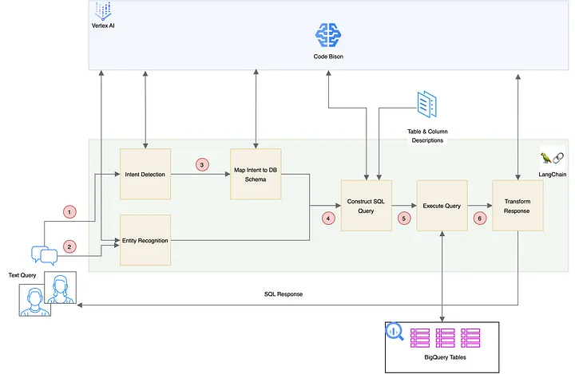

# Pattern I: Intent Detection and Entity Recognition with Text-to-SQL

### Advantages:
- Suitable for small BigQuery/SQL datasets with a limited number of tables and columns.
- Ideal for replacing existing intent detection and NER systems with LLM-based solutions.
- Simplifies the pipeline by eliminating the need for multiple model training and re-training pipelines.
- Appropriate for client-facing applications or systems with a limited range of scenarios.
- Aims for high accuracy in SQL query generation and offers explainability.
- Facilitates easier debugging and inspection of individual modules or components.

### Limitations:

- Expensive cost
- Expansion to include new scenarios requires manual updates to the data used for few-shot prompting.
- Lacks the flexibility to automatically address novel query scenarios without manual intervention.

