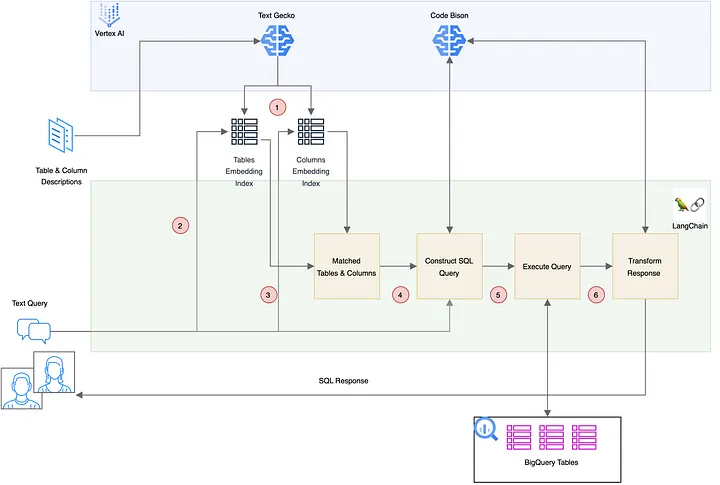

# Pattern II: LLM Flow with Retrieval-Augmented Generation (RAG)

---

**Advantages:** 
- Suitable for processing large data sets and wide tables in BigQuery.
- Simplifies workflow by collapsing intent detection, NER, and manual mapping into semantic search.
- Reduces inference costs due to shorter and more efficient commands.
- Prunes unnecessary data, focusing on relevant table and column descriptions.
- Improves scalability of data processing tasks.

**Limitations:**
- Adds complexity to the flow through the need for semantic search.
- Requires careful consideration in **embedding strategies** and parameters for effective search.
- One of the problems is that the tool often retrieves irrelevant tables and columns. This led to complex queries and unnecessary joins, which increased computation time and resulted in unnecessarily long responses.
- Given that the initial stage of the approach is essentially a search, it suffers from common problems in information retrieval such as poor recall and precision. This may require mitigation strategies such as re-ranking to highlight the most relevant results.

https://medium.com/@OmkarSadekar/text-to-sql-using-llm-and-context-injection-with-rag-for-large-databases-8a2ae4f171ee