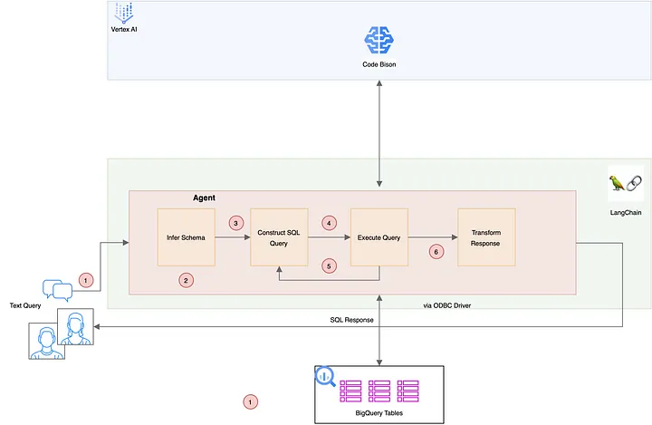

# Pattern 3: SQL Agent

---
**Advantages:**
- Greatly simplifies user tasks.
- Can be implemented quickly to address various scenarios.
- The system learns and improves its performance from setbacks.
- Very effective for databases with uniform schema and recognised query operations.

**Limitations:**
- It may be a bit difficult for standardised agents to navigate the intricacies of database architecture.
- The system is not very adaptable and customisation could be better.
- LLM has a context window that limits the amount of text it can handle. This may pose a problem for large databases.
- It may require refining the LLM agent's queries and parameters to meet your specific database and query needs, thus adding to its opaque nature and limited adaptability.
- Agents often run into some issues when handling SQL databases, such as creating tables and fields that do not exist in the database.